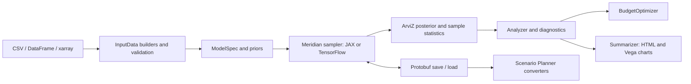

<!-- NOTICE: This file is new in this fork; see NOTICE at the repository root. -->

# Public-release audit

Audit date: 16 September 2026. Target: `sundar-ai-marketer/meridian`.
Starting revision: `6ca9299`. Upstream base: Google Meridian v2.0.0,
`00134ea`. This document distinguishes newly measured results from historical
results in [TRIAGE.md](TRIAGE.md).

## Release decision

The local software release gates pass, with the statistical limits below
retained explicitly. This release is suitable for public source distribution;
it is not certification of any dataset's causal validity or ROI accuracy.
No claim is made that every possible defect or every upstream issue has been
resolved. The repository's Actions page records the clean-runner CI results.

## Scope and architecture

This is a Python scientific library with two numerical backends, optional
integrations, command-line examples, and generated HTML reports. It is not a
hosted service or a web application with accounts.



| Boundary | Authoritative implementation | Checks |
|---|---|---|
| Input shapes, coordinates, missing data | `meridian/data/` | Builder, loader, validation, upstream regression tests |
| Priors, transformations, sampling | `meridian/model/`, `meridian/backend/` | Both backend suites, mathematical invariants, real fits |
| ROI, optimization, uncertainty | `meridian/analysis/` | Analyzer/optimizer tests, new diagnostic regressions, reference run |
| Synthetic recovery and timing | `meridian/validation/`, `meridian/benchmark/` | Recovery, rank interpretation, environment reporting tests |
| Model persistence | `meridian/schema/`, `proto/` | Serialization tests and exact ROI round-trip checks |
| Tabular integrations | `scenarioplanner/` | Converter and linking API tests; no live Sheets writes |
| Reports | `meridian/templates/` | Formatter tests, real generation, browser rendering and keyboard checks |
| Installation and distribution | `pyproject.toml`, `setup.py`, `scripts/`, Dockerfile | Builds, metadata, wheel runtime, clean container install |
| Release automation | `.github/` | Version action contract tests, backend matrix, integration smoke check |

Maintenance ownership remains with the fork maintainer. Google owns the
upstream project; it does not support this fork. Existing public imports and
the underlying statistical model remain intact.

## Confirmed findings and corrections

Severity describes the consequence of the defect, not exploitability.

| Priority | Finding | Correction and evidence |
|---|---|---|
| High | Infinite R-hat values could be discarded as though they were undefined deterministic terms, allowing an unhealthy fit to look better than it was. | Preserve infinities, reject invalid diagnostics, and report unavailable diagnostics without claiming their cause. Regression tests cover R-hat and ESS. |
| High | The inherited model review could label all-NaN R-hat as converged; mixed NaN reductions depended on parameter order. | Report convergence as unestablished when diagnostics are unavailable or non-finite, and reduce only reported values. |
| Medium | R-hat threshold labels blurred TFP's upstream estimator and ArviZ's rank-normalized estimator. | Name each estimator; describe 1.01 on TFP R-hat as a stricter heuristic rather than an implementation of the rank-normalized diagnostic. |
| Medium | The quickstart's unqualified convergence label hid weak effective sample sizes and stricter R-hat failures. | Print the rank-normalized threshold comparison, ESS/divergence cautions, and limits directly. Verify output against both saved reference fits. |
| High | Geographic paid-budget reliability included organic and non-media channels by default. | Explicitly request paid channels in both aggregated and per-geo calculations; mixed-channel regression test. |
| High | Fixed-truth recovery ranks were described and tested as simulation-based calibration. That uniform-null interpretation is not valid for this experiment. | Report descriptive rank fractions; remove the calibration verdict. Legacy rank fields remain documented for compatibility. |
| Medium | Invalid recovery configurations could reach sampling or divide by zero in relative ROI error. | Validate finite positive channel ROI/spend and meaningful dimensions at configuration construction, while preserving valid zero-noise and zero-lag settings. |
| Medium | Recovery output used an unqualified convergence label and a fixed 90% interval heading even with a different configured level. | Reject non-finite R-hat values, label the 1.2 comparison as a screening threshold, and print the configured interval level. Focused regression tests cover these cases. |
| High | Docker's unprivileged user could not write the default report/model output under root-owned `/app`. | Copy the runtime application with the runtime user's ownership; verify a real container fit and output workflow. |
| High | First publication without release tags made the version action fail before reaching its first-release branch. | A tested helper validates versions and handles a tagless repository. |
| Medium | Composite actions lacked required metadata; the schema version action used unsupported top-level environment metadata and ignored its Python-version input. The core version job installed the numerical stack for a metadata read. | Supply valid action metadata and read project versions without scientific dependencies. `actionlint` validates the corrected workflows. |
| Medium | `make test` omitted Scenario Planner although it was described as the full suite. A commit-message escape could skip CI tests. | Include both packages and remove the silent test bypass. |
| Medium | MLflow autolog tests left process-wide patches enabled, suppressing a later regression test's expected warning and writing to shared tracking storage. | Reproduced with 1 failure/14 passes; isolate each test's SQLite database and disable autologging on cleanup. The same sequence then passed all 15 checks. |
| Medium | Local unit tests did not by themselves prove the real fit-to-report integration. | Add `make test-e2e` and run the real fit, optimizer, save/load, and report workflow in CI. |
| Medium | Relative virtual-environment paths failed when setup was launched outside the checkout; Make recipes mishandled paths containing spaces. | Resolve the environment path before changing directory and quote executable paths. |
| Low | Setup's printed follow-up commands omitted shell quoting and the repository-directory step. | Print shell-escaped paths and an explicit `cd` command so the next steps also work with custom environment paths. |
| Medium | Reports clipped charts on narrow screens, despite having no document-level overflow. | Contain wide charts in focusable scroll regions; test arrow/Home/End panning and 320/390/1440px rendering. |
| Low | Optimization ROI tiles exposed binary floating-point artifacts after rounding, producing long decimal strings. | Format report values explicitly to one decimal place; preserve the numerical results. The optimizer output suite passed 23 tests, including a regression using NumPy scalar values. |
| High | Report templates used an unrecognized autoescape suffix, so data-derived text could be interpreted as HTML. | Enable escaping for report templates, preserve only explicitly rendered fragments, and serialize chart script values safely. Regression and browser checks verify literal labels, table values and quoted identifiers. |
| Medium | Package metadata and clone instructions still contained publication placeholders. | Use the selected fork URL; retain separate upstream attribution and documentation links. |
| Medium | Declared setuptools minimum did not support `project.license-files`. | Require setuptools >=77.0.3 in both build configurations and carry the schema package notice. |
| High | Schema compilation could log a failed Git/protoc command and continue building a distribution. The Docker builder also lacked Git for the local schema build. | Propagate build failures, preserve argument boundaries in paths with spaces, test the build contract, and install Git/CA certificates in the builder stage. |
| Medium | The security policy directed upstream vulnerability disclosures to public issues. | Link to Google's documented private security intake; describe a safe fallback for unavailable private reporting. |
| Low | Local environment variants and nested protobuf build metadata were not fully ignored. | Ignore `.env.*` while allowing `.env.example`, and ignore nested egg-info directories. |
| Low | Copied upstream publishing workflows performed unnecessary fork builds despite disabled publishing jobs. | Guard those jobs and correct the missing Python-version input. Automatic PyPI publication remains disabled. |
| Low | Benchmark records did not clearly identify the active computation backend and precision. | Record the resolved runtime backend and precision, with tests. |
| Medium | Backend initialization tests restored the module cache but left the parent package pointing at a temporary backend module, making later benchmark metadata depend on test order. | Restore the package alias during test cleanup. The failing initialization-then-metadata sequence and a package-alias regression now pass. |
| Medium | Four parallel scientific-test workers put a 16 GB hosted runner under substantial memory pressure before shutdown: 15,227 MB used and 2,031 MB of swap used in the final sample. | Limit CI to two workers and run analysis, model, and remaining tests in separate processes to release numerical caches between suites. Preserve all six backend/version combinations and record resource usage in the live log. |
| Low | Importing the benchmark failed on platforms without the Unix `resource` module. | Treat peak memory as unavailable when that platform API is absent; do not invent a comparable measurement. |

## Verification

Local reference environment: Python 3.11.8, macOS arm64, JAX 0.10.2,
TensorFlow 2.21.0, NumPy 2.3.5, ArviZ 0.19.0. Backend-specific tests run in
separate processes. The container is Linux arm64 with Python 3.11 and a fresh
dependency installation.

The full local suite stage completed with these results. The last recovery,
review, and benchmark corrections were verified separately with their complete
affected-module suites after this stage's test collection.

| Backend | Passed | Skipped | Subtests passed | Runtime |
|---|---:|---:|---:|---:|
| JAX | 5,685 | 44 | 556 | 1,706.77 s |
| TensorFlow | 5,680 | 49 | 556 | 1,977.10 s |

Both runs exited successfully with zero failed tests. Skips cover intentionally
invalid/redundant combinations and backend-specific expectations. They emitted
11,076 and 8,067 warnings respectively, including dependency deprecations and
diagnostic warnings from deliberately constrained fixtures. The JAX runner
also emitted a shutdown-time `KeyboardInterrupt` warning from an XLA garbage
collection callback; it did not fail a test or the process. These results are
not described as warning-free.

Additional verification:

- After the last runtime corrections, the full recovery, review checks/results,
  and benchmark modules passed 319 tests and two subtests on each backend
  (438.94 s JAX; 457.25 s TensorFlow). This includes simulation arithmetic,
  deterministic seeds, Wilson intervals, and small real recovery fits.
- Formatting of all 18 changed/new Python files preserved their parsed ASTs.
  The formatter targets Python 3.11, the minimum supported runtime.
- The 21 mathematical invariant cases pass on each backend: normalized adstock,
  zero-lag identity, zero/constant inputs, Hill's closed form and monotonicity,
  ROI as incremental outcome divided by spend, aggregation across geographies
  and time, and response-curve behavior. Float32 and float64 use explicit
  precision-appropriate tolerances.
- `pip check`: no broken requirements in the local environment.
- A fresh public clone completed `scripts/setup.sh` from outside the checkout,
  using a relative environment path containing spaces. Its environment check
  passed all installed extras, stylesheet compilation and a real fit with
  finite ROI.
- `actionlint` 1.7.12 and ShellCheck passed after correcting action metadata
  and shell quoting. Version-action contract tests and five schema build
  failure/success contract tests passed.
- The first GitHub run passed package, Docker and version jobs, but a hosted
  runner shut down during the TensorFlow/Python 3.11 suite. No test assertion
  failed before the interruption; matrix fail-fast cancelled the other legs.
  The matrix now retains independent results when one leg fails. Consult the
  [latest CI run](https://github.com/sundar-ai-marketer/meridian/actions/workflows/ci.yml)
  for verification of the published revision.
- Core and protobuf wheel/source builds succeeded; `twine check` passed all
  four artifacts.
- The core wheel contains compiled report CSS, LICENSE, and NOTICE, and
  excludes `*_test.py` files.
- An installed wheel, imported from its installation directory rather than
  the source checkout, completed a real fit, generated finite ROI, preserved
  ROI exactly through protobuf save/load, and generated a styled report.
- The new integration check passed on both JAX and TensorFlow. Its deliberately
  small chains test integration, not convergence or recovery accuracy.
- A fresh fixed-truth recovery run used 5 geographies, 104 periods, three
  channels, concave response, no carryover, seed 7, and four chains with
  1,000 adaptation / 500 burn-in / 500 retained draws. It recovered channel
  ordering and covered every true ROI with its 90% interval. Maximum
  rank-normalized R-hat was 1.0294: below the tool's 1.2 pass threshold but
  above the stricter 1.01 target. This is one recovery experiment, not SBC
  or proof of general calibration.

  | True ROI | Posterior median | 90% interval | Relative error |
  |---|---|---|---|
  | 1.0 | 0.972 | [0.417, 2.130] | -2.8% |
  | 2.0 | 1.569 | [1.057, 2.330] | -21.6% |
  | 4.0 | 4.374 | [2.915, 6.207] | +9.4% |

- The short bundled reference run completed all stages in 700 seconds:
  current ROI 2.461, optimized ROI 2.498. Maximum ArviZ rank-normalized R-hat
  was 1.5958; upstream TFP R-hat on the saved model was 2.5781. Minimum
  bulk/tail ESS was 6.93/13.53 with zero divergences. This short run did
  **not** converge and its ROI values are illustrative only.
- The longer reference run completed in 3,316 seconds under concurrent audit
  load, using seven chains, 2,000 adaptation steps, 500 burn-in steps, and
  1,000 retained draws per chain. Rank-normalized R-hat was 1.0456; TFP R-hat
  was 1.0179. Minimum bulk/tail ESS was 157.85/127.90, with zero divergences
  across 7,000 draws. Current/optimized ROI was 2.411/2.449. The saved model
  reloaded successfully and produced finite ROI. **The stricter 1.01 target
  and 400-draw ESS heuristic were not met.** This is evidence that the
  workflow functions, not a decision-ready model. The final quickstart now
  prints these limitations directly rather than an unqualified approval.
- A fresh Linux arm64 Docker image built with the local schema package,
  passed `pip check`, and completed the real fit, optimization, exact ROI
  save/load comparison, and styled report workflow as user `meridian`.
  Output files were copied out successfully. Measured image size:
  900,726,138 bytes. JAX ROI was 0.649262 before and 0.693490 after optimization
  on the deliberately small smoke fixture.
- Browser checks rendered all 11 report charts without JavaScript errors.
  The mobile repair was checked at 320px, 390px, and 1440px, including contained
  overflow and keyboard panning. The full saved-model report passed the same
  checks after the text-escaping correction, with desktop and mobile screenshots
  reviewed. A separate browser fixture verified that HTML-like labels remain
  literal text, embedded script text does not execute, and quoted chart
  identifiers still render. Formatter tests: 40 passed.
- EDA and optimization reports were also checked at 320px, 390px and 1440px.
  Their long diagnostic text and statistic tiles now wrap on narrow screens.
  The optimization browser check uses a 500px minimum desktop chart width for
  its two-column layout, while model-summary and EDA retain the 600px default.
  These checks cover rendering, page overflow, browser errors and keyboard
  chart panning where a chart is wider than its viewport.
- After the escaping and recovery-output corrections, complete formatter,
  summarizer and review-result modules passed 234 tests; the complete EDA
  report module passed 162 tests. The recovery module passed 59 tests on each
  backend, including the corrected threshold and interval labels. A final
  14-test output gate also checked fractional interval labels (92.5%).
- After correcting backend-test cleanup, the complete backend and benchmark
  modules passed 853 tests on each backend. The original failing ordered
  initialization/metadata sequence also passed.
- CI test partitioning was checked against full-suite collection: analysis
  (1,706), model (2,166), and remaining modules (1,907) cover all 5,779 test
  identifiers exactly once. Every phase runs even if an earlier phase fails;
  any failed phase fails the job.
- `pip-audit` checked 173 local and 172 Linux-container dependency versions
  against its public advisory service and reported no known vulnerabilities
  on the audit date. This is a point-in-time advisory check, not proof of zero risk.
- Gitleaks 8.30.1 reported zero findings for the current source tree and the
  history scan using `--log-opts='--all'` (1,182 commits scanned; 1,190
  reachable commits). Additional high-confidence credential and private-key
  checks found no matches. Existing upstream author metadata is preserved.

## Reproduce the checks

```sh
make setup
make test
make test-tf
make test-e2e
MERIDIAN_BACKEND=tensorflow make test-e2e
make build
.venv/bin/python examples/quickstart.py --full
.venv/bin/python -m meridian.validation --response concave --max-lag 0 --seed 7
docker build -t meridian .
docker run --rm meridian python scripts/test_end_to_end.py
```

The full reference fit is substantially slower than the smoke check. Keep
performance timings together with backend, precision, hardware, and sampling
settings; they are not a service-level promise.

## Limits and remaining risks

- Passing software checks does not establish causal identification, valid
  business assumptions, or accurate ROI on unseen data. Review prior
  predictive behavior, divergences, R-hat, effective sample size, and model
  specification for each dataset.
- SamplingDiagnostics reports upstream TFP R-hat against thresholds of 1.2
  and 1.01; the stricter comparison is a heuristic on that estimator. The
  quickstart and recovery tools use ArviZ's rank-normalized R-hat. Always name
  the estimator when comparing results. Neither replaces the other
  diagnostics or proves that a model is correct.
- The bundled data has no extra media history before the KPI window. With
  `max_lag=8`, the library explicitly warns about zero-padded carryover at the
  start. This reference run preserves that existing example configuration.
- The short synthetic integration fixture is not a recovery study. The
  historical recovery measurements in TRIAGE.md were not rerun across many
  seeds during this audit; the fixed-truth recovery tool is not SBC.
- Real Google Sheets/Looker writes, authenticated MLflow services, GPU/CUDA,
  and hosted Codespaces are outside the live integration checks. Their local
  unit tests or configuration review must not be described as live validation.
- Report charts and fonts load external resources and need internet access.
  Browser checks do not constitute a full assistive-technology audit.
- Dependencies are bounded but not completely locked. New resolutions can
  differ from the audited environment; CI detects many, not all, regressions.
  Schema builds fetch `googleapis` from `master`, and GitHub Actions use major
  version tags; these external inputs are not immutable.
- [TRIAGE.md](TRIAGE.md) retains unresolved upstream issues and declined
  feature requests. Publication is not a claim that all upstream issues have
  been fixed.

## Source verification

Build metadata support was checked against the [setuptools license migration
guide](https://setuptools.pypa.io/en/stable/userguide/license_migration.html)
and [Python packaging guidance](https://packaging.python.org/en/latest/guides/writing-pyproject-toml/).
Private disclosure routing was checked against [Google Meridian's security
policy](https://github.com/google/meridian/security). These external checks
were performed on 16 September 2026.

Diagnostic labels were checked against the installed implementation and the
[ArviZ 0.19.0 R-hat documentation](https://python.arviz.org/en/v0.19.0/api/generated/arviz.rhat.html)
and [TFP diagnostic API](https://www.tensorflow.org/probability/api_docs/python/tfp/mcmc/potential_scale_reduction).
The recovery/SBC distinction follows the requirement to draw parameters from
the fitted prior described in [Stan's SBC guide](https://mc-stan.org/docs/stan-users-guide/simulation-based-calibration.html).
These checks apply to the audited dependency versions; they were reviewed on
16 September 2026.

Report escaping was checked against the installed Jinja implementation and its
[autoescape API documentation](https://jinja.palletsprojects.com/en/stable/api/#jinja2.select_autoescape)
on 16 September 2026. The default suffix selector does not cover `.html.jinja`;
the corrected environment explicitly includes that suffix family.

## Rollback

The audit starts from a clean working tree at `6ca9299`. Changes are recorded
in release-preparation commits. Revert those commits in reverse order to
restore the previous code and setup behavior without rewriting upstream history.
Generated models, logs, environments, and browser artifacts are not required
to run the library and are kept out of the source release.
