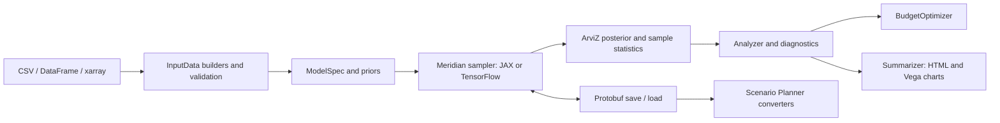

<!-- NOTICE: This file is new in this fork; see NOTICE at the repository root. -->

# Public-release audit

Audit date: 16 September 2026. Target: `sundar-ai-marketer/meridian`.
Starting revision: `3983667`. Upstream base: Google Meridian v2.0.0,
`00134ea`. This document distinguishes newly measured results from historical
results in [TRIAGE.md](TRIAGE.md).

## Release decision

The local software release gates pass, with the statistical limits below
retained explicitly. This release is suitable for public source distribution;
it is not certification of any dataset's causal validity or ROI accuracy.
No claim is made that every possible defect or every upstream issue has been
resolved. The repository's Actions page records the clean-runner CI results.

## Scope and architecture

This is a Python scientific library with two numerical backends, optional
integrations, command-line examples, and generated HTML reports. It is not a
hosted service or a web application with accounts.



| Boundary | Authoritative implementation | Checks |
|---|---|---|
| Input shapes, coordinates, missing data | `meridian/data/` | Builder, loader, validation, upstream regression tests |
| Priors, transformations, sampling | `meridian/model/`, `meridian/backend/` | Both backend suites, mathematical invariants, real fits |
| ROI, optimization, uncertainty | `meridian/analysis/` | Analyzer/optimizer tests, new diagnostic regressions, reference run |
| Synthetic recovery and timing | `meridian/validation/`, `meridian/benchmark/` | Recovery, rank interpretation, environment reporting tests |
| Model persistence | `meridian/schema/`, `proto/` | Serialization tests and exact ROI round-trip checks |
| Tabular integrations | `scenarioplanner/` | Converter and linking API tests; no live Sheets writes |
| Reports | `meridian/templates/` | Formatter tests, real generation, browser rendering and keyboard checks |
| Installation and distribution | `pyproject.toml`, `setup.py`, `scripts/`, Dockerfile | Builds, metadata, wheel runtime, clean container install |
| Release automation | `.github/` | Version action contract tests, backend matrix, integration smoke check |

Maintenance ownership remains with the fork maintainer. Google owns the
upstream project; it does not support this fork. Existing public imports and
the underlying statistical model remain intact.

## Confirmed findings and corrections

Severity describes the consequence of the defect, not exploitability.

| Priority | Finding | Correction and evidence |
|---|---|---|
| High | Infinite R-hat values could be discarded as though they were undefined deterministic terms, allowing an unhealthy fit to look better than it was. | Preserve infinities, reject invalid diagnostics, and report unavailable diagnostics without claiming their cause. Regression tests cover R-hat and ESS. |
| High | The inherited model review could label all-NaN R-hat as converged; mixed NaN reductions depended on parameter order. | Report convergence as unestablished when diagnostics are unavailable or non-finite, and reduce only reported values. |
| Medium | R-hat threshold labels blurred TFP's upstream estimator and ArviZ's rank-normalized estimator. | Name each estimator; describe 1.01 on TFP R-hat as a stricter heuristic rather than an implementation of the rank-normalized diagnostic. |
| Medium | The quickstart's unqualified convergence label hid weak effective sample sizes and stricter R-hat failures. | Print the rank-normalized threshold comparison, ESS/divergence cautions, and limits directly. Verify output against both saved reference fits. |
| High | Geographic paid-budget reliability included organic and non-media channels by default. | Explicitly request paid channels in both aggregated and per-geo calculations; mixed-channel regression test. |
| High | Fixed-truth recovery ranks were described and tested as simulation-based calibration. That uniform-null interpretation is not valid for this experiment. | Report descriptive rank fractions; remove the calibration verdict. Legacy rank fields remain documented for compatibility. |
| Medium | Invalid recovery configurations could reach sampling or divide by zero in relative ROI error. | Validate finite positive channel ROI/spend and meaningful dimensions at configuration construction, while preserving valid zero-noise and zero-lag settings. |
| Medium | Recovery output used an unqualified convergence label and a fixed 90% interval heading even with a different configured level. | Reject non-finite R-hat values, label the 1.2 comparison as a screening threshold, and print the configured interval level. Focused regression tests cover these cases. |
| High | Docker's unprivileged user could not write the default report/model output under root-owned `/app`. | Copy the runtime application with the runtime user's ownership; verify a real container fit and output workflow. |
| High | First publication without release tags made the version action fail before reaching its first-release branch. | A tested helper validates versions and handles a tagless repository. |
| Medium | Composite actions lacked required metadata; the schema version action used unsupported top-level environment metadata and ignored its Python-version input. The core version job installed the numerical stack for a metadata read. | Supply valid action metadata and read project versions without scientific dependencies. `actionlint` validates the corrected workflows. |
| Medium | `make test` omitted Scenario Planner although it was described as the full suite. A commit-message escape could skip CI tests. | Include both packages and remove the silent test bypass. |
| Medium | MLflow autolog tests left process-wide patches enabled, suppressing a later regression test's expected warning and writing to shared tracking storage. | Reproduced with 1 failure/14 passes; isolate each test's SQLite database and disable autologging on cleanup. The same sequence then passed all 15 checks. |
| Medium | Local unit tests did not by themselves prove the real fit-to-report integration. | Add `make test-e2e` and run the real fit, optimizer, save/load, and report workflow in CI. |
| Medium | Relative virtual-environment paths failed when setup was launched outside the checkout; Make recipes mishandled paths containing spaces. | Resolve the environment path before changing directory and quote executable paths. |
| Low | Setup's printed follow-up commands omitted shell quoting and the repository-directory step. | Print shell-escaped paths and an explicit `cd` command so the next steps also work with custom environment paths. |
| Medium | Reports clipped charts on narrow screens, despite having no document-level overflow. | Contain wide charts in focusable scroll regions; test arrow/Home/End panning and 320/390/1440px rendering. |
| Low | Optimization ROI tiles exposed binary floating-point artifacts after rounding, producing long decimal strings. | Format report values explicitly to one decimal place; preserve the numerical results. The optimizer output suite passed 23 tests, including a regression using NumPy scalar values. |
| High | Report templates used an unrecognized autoescape suffix, so data-derived text could be interpreted as HTML. | Enable escaping for report templates, preserve only explicitly rendered fragments, and serialize chart script values safely. Regression and browser checks verify literal labels, table values and quoted identifiers. |
| Medium | Package metadata and clone instructions still contained publication placeholders. | Use the selected fork URL; retain separate upstream attribution and documentation links. |
| Medium | Declared setuptools minimum did not support `project.license-files`. | Require setuptools >=77.0.3 in both build configurations and carry the schema package notice. |
| High | Schema compilation could log a failed Git/protoc command and continue building a distribution. The Docker builder also lacked Git for the local schema build. | Propagate build failures, preserve argument boundaries in paths with spaces, test the build contract, and install Git/CA certificates in the builder stage. |
| Medium | The security policy directed upstream vulnerability disclosures to public issues. | Link to Google's documented private security intake; describe a safe fallback for unavailable private reporting. |
| Low | Local environment variants and nested protobuf build metadata were not fully ignored. | Ignore `.env.*` while allowing `.env.example`, and ignore nested egg-info directories. |
| Low | Copied upstream publishing workflows performed unnecessary fork builds despite disabled publishing jobs. | Guard those jobs and correct the missing Python-version input. Automatic PyPI publication remains disabled. |
| Low | Benchmark records did not clearly identify the active computation backend and precision. | Record the resolved runtime backend and precision, with tests. |
| Medium | Backend initialization tests restored the module cache but left the parent package pointing at a temporary backend module, making later benchmark metadata depend on test order. | Restore the package alias during test cleanup. The failing initialization-then-metadata sequence and a package-alias regression now pass. |
| Medium | Parallel scientific-test workers exhausted hosted-runner memory. Four workers reached 15,227 MiB used and 2,031 MiB swap; two workers later exhausted nearly all swap when real-fit suites accumulated compiled graphs together. Even a passing combined analysis run nearly exhausted RAM and swap. | Run analyzer, optimizer, remaining analysis, model, and non-fit remaining tests in separate two-worker sessions. Run benchmark, recovery, mathematical-invariant, and upstream-regression suites each in a fresh serial process. Preserve all six backend/version combinations and record resource usage in the live log. |
| Low | Importing the benchmark failed on platforms without the Unix `resource` module. | Treat peak memory as unavailable when that platform API is absent; do not invent a comparable measurement. |

## Verification

Local reference environment: Python 3.11.8, macOS arm64, JAX 0.10.2,
TensorFlow 2.21.0, NumPy 2.3.5, ArviZ 0.19.0. Backend-specific tests run in
separate processes. The container is Linux arm64 with Python 3.11 and a fresh
dependency installation.

The full local suite stage completed with these results. The last recovery,
review, and benchmark corrections were verified separately with their complete
affected-module suites after this stage's test collection.

| Backend | Passed | Skipped | Subtests passed | Runtime |
|---|---:|---:|---:|---:|
| JAX | 5,685 | 44 | 556 | 1,706.77 s |
| TensorFlow | 5,680 | 49 | 556 | 1,977.10 s |

Both runs exited successfully with zero failed tests. Skips cover intentionally
invalid/redundant combinations and backend-specific expectations. They emitted
11,076 and 8,067 warnings respectively, including dependency deprecations and
diagnostic warnings from deliberately constrained fixtures. The JAX runner
also emitted a shutdown-time `KeyboardInterrupt` warning from an XLA garbage
collection callback; it did not fail a test or the process. These results are
not described as warning-free.

Additional verification:

- After the last runtime corrections, the full recovery, review checks/results,
  and benchmark modules passed 319 tests and two subtests on each backend
  (438.94 s JAX; 457.25 s TensorFlow). This includes simulation arithmetic,
  deterministic seeds, Wilson intervals, and small real recovery fits.
- Formatting of all 18 changed/new Python files preserved their parsed ASTs.
  The formatter targets Python 3.11, the minimum supported runtime.
- The 21 mathematical invariant cases pass on each backend: normalized adstock,
  zero-lag identity, zero/constant inputs, Hill's closed form and monotonicity,
  ROI as incremental outcome divided by spend, aggregation across geographies
  and time, and response-curve behavior. Float32 and float64 use explicit
  precision-appropriate tolerances.
- `pip check`: no broken requirements in the local environment.
- A fresh public clone completed `scripts/setup.sh` from outside the checkout,
  using a relative environment path containing spaces. Its environment check
  passed all installed extras, stylesheet compilation and a real fit with
  finite ROI.
- `actionlint` 1.7.12 and ShellCheck passed after correcting action metadata
  and shell quoting. Version-action contract tests and the then-five schema
  build contracts passed; the follow-up below expands those contracts to seven.
- The first GitHub run passed package, Docker and version jobs, but a hosted
  runner shut down during the TensorFlow/Python 3.11 suite. No test assertion
  failed before the interruption; matrix fail-fast cancelled the other legs.
  The matrix now retains independent results when one leg fails. Consult the
  [latest CI run](https://github.com/sundar-ai-marketer/meridian/actions/workflows/ci.yml)
  for verification of the published revision.
- Core and protobuf wheel/source builds succeeded; `twine check` passed all
  four artifacts.
- The core wheel contains compiled report CSS, LICENSE, and NOTICE, and
  excludes `*_test.py` files.
- An installed wheel, imported from its installation directory rather than
  the source checkout, completed a real fit, generated finite ROI, preserved
  ROI exactly through protobuf save/load, and generated a styled report.
- The new integration check passed on both JAX and TensorFlow. Its deliberately
  small chains test integration, not convergence or recovery accuracy.
- A fresh fixed-truth recovery run used 5 geographies, 104 periods, three
  channels, concave response, no carryover, seed 7, and four chains with
  1,000 adaptation / 500 burn-in / 500 retained draws. It recovered channel
  ordering and covered every true ROI with its 90% interval. Maximum
  rank-normalized R-hat was 1.0294: below the tool's 1.2 pass threshold but
  above the stricter 1.01 target. This is one recovery experiment, not SBC
  or proof of general calibration.

  | True ROI | Posterior median | 90% interval | Relative error |
  |---|---|---|---|
  | 1.0 | 0.972 | [0.417, 2.130] | -2.8% |
  | 2.0 | 1.569 | [1.057, 2.330] | -21.6% |
  | 4.0 | 4.374 | [2.915, 6.207] | +9.4% |

- The short bundled reference run completed all stages in 700 seconds:
  current ROI 2.461, optimized ROI 2.498. Maximum ArviZ rank-normalized R-hat
  was 1.5958; upstream TFP R-hat on the saved model was 2.5781. Minimum
  bulk/tail ESS was 6.93/13.53 with zero divergences. This short run did
  **not** converge and its ROI values are illustrative only.
- The longer reference run completed in 3,316 seconds under concurrent audit
  load, using seven chains, 2,000 adaptation steps, 500 burn-in steps, and
  1,000 retained draws per chain. Rank-normalized R-hat was 1.0456; TFP R-hat
  was 1.0179. Minimum bulk/tail ESS was 157.85/127.90, with zero divergences
  across 7,000 draws. Current/optimized ROI was 2.411/2.449. The saved model
  reloaded successfully and produced finite ROI. **The stricter 1.01 target
  and 400-draw ESS heuristic were not met.** This is evidence that the
  workflow functions, not a decision-ready model. The final quickstart now
  prints these limitations directly rather than an unqualified approval.
- A fresh Linux arm64 Docker image built with the local schema package,
  passed `pip check`, and completed the real fit, optimization, exact ROI
  save/load comparison, and styled report workflow as user `meridian`.
  Output files were copied out successfully. Measured image size:
  900,726,138 bytes. JAX ROI was 0.649262 before and 0.693490 after optimization
  on the deliberately small smoke fixture.
- Browser checks rendered all 11 report charts without JavaScript errors.
  The mobile repair was checked at 320px, 390px, and 1440px, including contained
  overflow and keyboard panning. The full saved-model report passed the same
  checks after the text-escaping correction, with desktop and mobile screenshots
  reviewed. A separate browser fixture verified that HTML-like labels remain
  literal text, embedded script text does not execute, and quoted chart
  identifiers still render. Formatter tests: 40 passed.
- EDA and optimization reports were also checked at 320px, 390px and 1440px.
  Their long diagnostic text and statistic tiles now wrap on narrow screens.
  The optimization browser check uses a 500px minimum desktop chart width for
  its two-column layout, while model-summary and EDA retain the 600px default.
  These checks cover rendering, page overflow, browser errors and keyboard
  chart panning where a chart is wider than its viewport.
- After the escaping and recovery-output corrections, complete formatter,
  summarizer and review-result modules passed 234 tests; the complete EDA
  report module passed 162 tests. The recovery module passed 59 tests on each
  backend, including the corrected threshold and interval labels. A final
  14-test output gate also checked fractional interval labels (92.5%).
- After correcting backend-test cleanup, the complete backend and benchmark
  modules passed 853 tests on each backend. The original failing ordered
  initialization/metadata sequence also passed.
- CI test partitioning was checked against full-suite collection: analysis
  (1,706 across three fresh processes), model (2,166), non-fit remaining
  modules (1,779), benchmark (29),
  recovery (59), mathematical invariants (21), and upstream regressions (19)
  cover all 5,779 test identifiers exactly once. Every phase runs even if an
  earlier phase fails; any failed phase fails the job.
- `pip-audit` checked 173 local and 172 Linux-container dependency versions
  against its public advisory service and reported no known vulnerabilities
  on the audit date. This is a point-in-time advisory check, not proof of zero risk.
- Gitleaks 8.30.1 reported zero findings for the current source tree and the
  history scan using `--log-opts='--all'` (1,182 commits scanned; 1,190
  reachable commits). Additional high-confidence credential and private-key
  checks found no matches. Existing upstream author metadata is preserved.

## Reproduce the checks

```sh
make setup
make test
make test-tf
make test-e2e
MERIDIAN_BACKEND=tensorflow make test-e2e
make build
.venv/bin/python examples/quickstart.py --full
.venv/bin/python -m meridian.validation --response concave --max-lag 0 --seed 7
docker build -t meridian .
docker run --rm meridian python scripts/test_end_to_end.py
```

The full reference fit is substantially slower than the smoke check. Keep
performance timings together with backend, precision, hardware, and sampling
settings; they are not a service-level promise.

## Additional hardening after the first green public release

Commit `50a608e` passed all nine hosted CI jobs: Python 3.11–3.13 on both
JAX and TensorFlow, distribution builds, version checks and Docker. Each JAX
matrix leg passed 5,735 tests with 44 skips; each TensorFlow leg passed 5,730
with 49 skips. All six real-fit integration checks preserved ROI exactly
through serialization. The final memory-isolated TensorFlow runs retained at
least about 4 GiB of available runner memory and used no swap. These are the
baseline results, not a substitute for checking CI on subsequent commits.

The follow-up addresses concrete remaining limits:

- Standard generated HTML now embeds exact, SHA-256-checked Vega libraries,
  icons and an icon font, along with their redistribution licenses. Summary
  (11 charts), optimization (4) and EDA (9) reports passed at 320/390/1440px
  with the network disabled, zero external requests, no browser errors and
  working keyboard panning. A broader report gate passed 400 tests and 272
  subtests. A later focused test verifies that a shared report's exploratory
  note remains visible and is safely escaped. The final template, summarizer
  and visualizer gate passed 246 tests and 18 subtests after the last changes.
- The local test commands now use the same fresh-process, two-worker phases
  as CI. Fit-heavy suites remain serial. Six runner contracts cover failed
  phases, empty collection, collection errors, cancellation and invalid
  worker counts. All 5,807 currently collected test cases map to exactly one
  runner phase; no test selection is removed to fit the memory budget.
- Clean setup from outside the checkout, with spaces in the environment path,
  passed imports and `pip check`. The universal lock resolves 199 packages;
  six Linux/macOS and Python 3.11–3.13 resolution dry-runs pass. Python 3.11
  retains JAX/JAXlib 0.10.2, TensorFlow 2.21.0, NumPy 2.3.5 and ArviZ 0.19.0.
  Python 3.12/3.13 select JAX/JAXlib 0.11.1 and SciPy 1.18.1 according to their
  supported-Python metadata; the full hosted matrix checks those actual installs.
  `uv lock --check` verifies metadata freshness. uv builds constrain setuptools,
  libsass and the schema compiler; ordinary standalone distribution builds and
  the explicit pip fallback remain outside this frozen installation contract.
- Schema includes and GitHub Actions are pinned to full commit IDs. The
  schema builder verifies the fetched revision and fails on mismatches;
  seven build contract tests pass. Dependabot proposes action, uv and Docker
  updates for review. Its first proposals exceeded deliberate compatibility
  ceilings, so uv updates are now lockfile-only and Docker retains Python
  3.11; grouped weekly proposals limit CI load. The incompatible proposals
  were closed without merging. This policy follows GitHub's [Dependabot
  options reference](https://docs.github.com/en/code-security/reference/supply-chain-security/dependabot-options-reference),
  verified on 16 September 2026.
- An actual sampler-options call reproduced a JAX error: an ordinary
  `dual_averaging_kwargs` dictionary was unhashable at the static JIT boundary.
  The public backend wrapper now copies/freezes the mapping before JIT;
  tests no longer hide the problem by converting it in their helper.
- Analysis test utilities now import ElementTree explicitly, removing an
  import-order dependency in their evaluated type annotations.
- A temporary local HTTP MLflow service completed a real Meridian fit,
  optimization, save/load and report workflow. Autologging recorded 73
  parameters; a metric and JSON artifact survived exact HTTP round trips.
  This checks a real local service, not cloud authentication or hosted policy.
  `scripts/test_mlflow_integration.py` retains this regression in CI; its final
  process-group cleanup revision also passed locally.
- Both JAX and TensorFlow passed all 21 focused strict-quality/quickstart tests.
  Six additional subcases verify empty sampling axes return unavailable
  diagnostics rather than indexing/division errors, even with deterministic
  metadata. Four real backend mapping/execution regressions passed. An intentionally
  inadequate CLI fit saved model and JSON, exited 2 and produced no summary.
  The passing reference was then exercised through the same positive gate,
  ROI, optimization and HTML output helpers.
- Fresh wheel/sdist builds passed metadata checks. The installed wheel
  completed real fit/optimization/save-load/report E2E with exact ROI
  serialization, and every embedded asset matched its manifest digest.
  A read-only source scan reported zero secrets across approximately 20 MB.
  The exact chart-library versions reported zero npm advisories in the
  resolved dependency graph on 16 September 2026; this is an advisory scan,
  not a proof that bundled third-party code has no defects.
- The final container advisory scan exposed an old `pip` seeded by `venv`.
  The development lock now includes pip 26.2.1, and setup's isolated uv
  bootstrap also pins that installer. This prevents successful runtime imports
  from masking an outdated package-management tool. The clean locked macOS
  environment then reported zero known advisories; the local fork itself is
  unpublished on PyPI and is excluded from registry advisory matching. The
  rebuilt Linux arm64 image also reported zero known advisories in registry
  dependencies and passed the non-root model-to-report integration again.

### Container OS security

A checksum-verified Trivy 0.74.0 scan (database updated 16 September 2026)
identified 177 advisory/package rows, representing 90 distinct advisories,
in the initially pinned Debian 13.6 image. Three critical findings and other
fixable findings were present in inherited OS packages. Both Docker stages
now apply the available Debian updates before use.

The rebuilt Debian 13.7 image has **zero critical findings and zero findings
with a vendor fix available** in that database snapshot. It still has 149
advisory/package rows representing 64 distinct advisories, including eight
high-severity advisory IDs without a listed vendor fix. The
[complete retained inventory](docs/validation/container-os-2026-09-16.json)
records package versions and vendor-tracker links. These are scanner findings;
package-level matches do not by themselves prove reachable exploits in this
non-root, local-analysis container. They must not be described as resolved.

CI retains the full OS report and blocks high/critical findings with a vendor
fix available. The report includes unfixed findings; the gate's filtering is
explicit rather than suppressing the inventory. The scanner release and
Linux archive checksum are pinned. [SECURITY.md](SECURITY.md) describes clean
rebuilds and the limits of this policy. Python/JavaScript dependency advisory
checks above are separate from OS-package findings.

#### Base images evaluated and rejected

On 17 September 2026 four alternative bases were scanned with the same pinned
scanner on `linux/amd64` to test whether the residual count could be reduced
by changing the image rather than by waiting for Debian. Counts are unique
advisories with no vendor fix, and unique high or critical advisories with no
vendor fix:

| Base | Unfixed | Unfixed high/critical | Note |
| --- | ---: | ---: | --- |
| `python:3.11-slim` (current, after updates) | 64 | 8 | in use |
| `gcr.io/distroless/python3-debian13` | 55 | 11 | more high findings |
| `gcr.io/distroless/python3-debian12` | 145 | 26 | older Debian |
| `cgr.dev/chainguard/python` (Wolfi) | 0 | 0 | Python 3.14 only |
| `python:3.13-slim`, `python:3.14-slim` | 64 | 8 | identical to current |

Distroless removes `util-linux`, `perl-base`, `systemd` and `login` — three of
the eight current high findings — but adds six new ones from the packages its
own Python needs (`krb5`, `libexpat1`, `libsqlite3-0`, `libpython3.13`). It is
a worse position, not a better one, and it moves the image off the tested
Python 3.11.

Chainguard's image reports no findings, with 75 packages inventoried, so the
result is package visibility rather than an absence of metadata. Its freely
available tag ships Python 3.14, and TensorFlow 2.21 — this project's pinned
range — publishes no `cp314` wheel, so the TensorFlow backend cannot be
installed there. It was rejected on that basis, not on the scan.

Copying a Python installation into `gcr.io/distroless/cc-debian13` would report
19 findings and no high ones, but only because no package database would
describe the copied libraries. The risk would be unchanged and would stop being
counted. That is scanner evasion and was not done.

The conclusion is that 64 unfixed advisories, 8 of them high, is the floor for
a Debian-based image that can run this project's pinned TensorFlow. It is not
evidence that the image is safe.

#### Reachability triage

Because the residual findings cannot be fixed here, they are triaged instead.
`scripts/container_reachability_probe.py` runs inside the built image, imports
Meridian and scenarioplanner, performs real tensor work and a report-module
import, then reads `/proc/self/maps` and attributes every mapped file to its
dpkg package.

Measured on an `arm64` rebuild on 17 September 2026: **87 OS packages
installed, 11 loaded** by that workflow. That rebuild independently reproduced
the published counts — 149 rows, 64 unique advisories, none with a vendor fix,
8 high — on a different architecture and a later scanner database.

Of the 64, **27 involve at least one loaded package and 37 involve none**. Four
of the eight high findings (`ncurses`, `systemd`, `libacl1`, `perl-base`) touch
no package the workflow loads. The other four are the `util-linux` group and
map to `libuuid1`, which is loaded.

The per-advisory table is
[docs/validation/os-triage-latest.md](docs/validation/os-triage-latest.md), the
load evidence is
[container-reachability-latest.json](docs/validation/container-reachability-latest.json).
The classification has two values, `loaded` and `not-loaded`, and neither is a
verdict: `loaded` is not exploitability, and `not-loaded` describes the default
container command only. Debian records advisories against source packages, so a
row naming `libuuid1` may describe a defect in `mount` or `login` built from
the same source; resolving that needs the vendor tracker.

#### Keeping it current

A dated inventory decays. The
[container-rescan](.github/workflows/container-rescan.yml) workflow rebuilds
the image weekly with `docker build --pull`, rescans it, re-measures load
evidence, regenerates the triage, and commits the refreshed summary. It opens
an issue only when a high or critical finding has a vendor fix, which is the
case that is actually actionable. The full report stays a retained artifact;
the committed summary is kept compact so a weekly commit does not accumulate
megabytes.

### Strict sampling reference

The new `meridian.analysis.sampling_quality` gate assesses every scalar
stochastic posterior cell using ArviZ rank-normalized R-hat, bulk/tail ESS and
aligned post-warmup divergence flags. Unavailable, non-finite and unverified
constant draws block approval. Only constants proved by model metadata are
excluded. The quickstart always saves the model and standards-compliant JSON
before this gate; strict mode blocks downstream decision outputs on failure.
Exploratory reports carry their qualification inside the saved HTML.

The following trials all used the same seed (1), ROI prior, 20 geographies,
eight observed media-history weeks, 148 analysis weeks, four channels,
13 time knots, four chains, 2,000 adaptation and 500 burn-in iterations.
The knot count is an explicit alternative specification. We retained each
trial rather than discarding failed runs.

| Target acceptance | Retained draws per chain | Max rank R-hat | Min bulk ESS | Min tail ESS | Divergences | Gate |
|---|---:|---:|---:|---:|---:|---|
| 0.85 | 2,000 | 1.00737 | 788.84 | 990.22 | 18 | Fail |
| 0.95 | 2,000 | 1.00537 | 823.38 | 901.79 | 3 | Fail |
| 0.99 | 4,000 | 1.00744 | 679.78 | 776.07 | 0 | Pass |

The [full per-cell JSON assessment](docs/validation/strict-sampling-2026-09-16.json)
records the final result. The sampling call took 818 seconds locally and covers
325 stochastic cells and excludes five metadata-confirmed constants (four
fixed media slopes and the baseline geography intercept). This is one example
fit, not calibration certification, held-out predictive validation or evidence
of causal identification. The gate defaults follow the [Stan diagnostic
guidance](https://mc-stan.org/learn-stan/diagnostics-warnings.html), checked on
16 September 2026; comparisons name the ArviZ estimator explicitly.

A subsequent [exact README command run](docs/validation/strict-quickstart-2026-09-16.json)
completed the full strict workflow in 1,007 seconds in the clean locked
macOS environment: 4 × 4,000 draws, max rank R-hat 1.00591, min bulk/tail ESS
698.25/758.70 and zero divergences. It generated the model, JSON assessment,
ROI, budget optimization and HTML summary. Small numerical differences from
the earlier saved-model experiment are retained, not presented as bitwise
reproducibility.

### Ten-seed fixed-truth recovery

[Machine-readable measurements](docs/validation/recovery-2026-09-16.json)
include every seed and channel interval. Each fit used a fresh process: JAX
float64, 5 geographies, 104 periods, three channels with true ROI 1/2/4,
concave response, no carryover, four chains, 1,000 adaptation, 500 burn-in and
1,000 retained draws. Seeds derive deterministically from base seed 7.

| Channel | True ROI inside 90% interval | 95% Wilson interval for coverage | Median relative ROI error |
|---|---:|---:|---:|
| 0 | 10/10 | 72.25%–100% | +6.5% |
| 1 | 8/10 | 49.02%–94.33% | −14.4% |
| 2 | 7/10 | 39.68%–89.22% | −19.7% |

All ten fits recovered channel ordering and passed the legacy finite
rank-normalized R-hat <1.2 screening threshold. Several did not meet 1.01;
this experiment did not establish full strict sampling quality. The observed
interval misses must not be attributed solely to a model defect or to a
particular source of uncertainty. Fixed-truth coverage is not guaranteed to
equal nominal Bayesian interval probability. This is a ten-trial recovery
measurement, not SBC or general calibration certification; no failing seeds
were discarded and no priors were tuned to obtain coverage.

Reproduce this configuration with fresh processes and retained per-seed evidence:

```sh
.venv/bin/python scripts/run_recovery_study.py --replications 10 --seed 7 \
  --output-dir recovery-study
```

The command records configuration, derived seeds, package versions and source
hashes. It retains failed subprocess evidence and labels the 1.2 screen and
fixed-truth coverage limits explicitly.

## Limits and remaining risks

- Passing software checks does not establish causal identification, valid
  business assumptions, or accurate ROI on unseen data. Review prior
  predictive behavior, divergences, R-hat, effective sample size, and model
  specification for each dataset.
- SamplingDiagnostics reports upstream TFP R-hat against thresholds of 1.2
  and 1.01; the stricter comparison is a heuristic on that estimator. The
  quickstart and recovery tools use ArviZ's rank-normalized R-hat. Always name
  the estimator when comparing results. Neither replaces the other
  diagnostics or proves that a model is correct.
- The earlier saved reference used zero-padded carryover because the bundled
  CSV has no separate history window. The revised quickstart reserves eight
  observed media periods and models the remaining 148 periods; it does not
  invent historical observations. Historical fit metrics above retain their
  original analysis window and must not be compared as identical experiments.
- The short synthetic integration fixture is not a recovery study. The
  ten-seed experiment above adds measured recovery evidence at one fixed
  setting. It does not replace simulation-based calibration or validation on
  a user's own data and modeling assumptions.
- Real Google Sheets/Looker writes, authenticated cloud MLflow services,
  GPU/CUDA and hosted Codespaces still require the relevant account, hardware
  and environment. Local tests are not live validation of those boundaries.
  MLflow's loopback HTTP tracking/artifact service is now tested end to end.
- Standard reports render offline. Following documentation links or rendering
  caller-supplied chart specifications with remote data still needs a network.
  Embedded assets increase HTML size. Browser and keyboard checks are not a
  full assistive-technology audit.
- The container retains vendor-unfixed OS advisory findings, including high
  severities. See the dated OS inventory above; passing CI is not a claim of
  a vulnerability-free image. Alternative bases were measured and none
  improved on this without either dropping the TensorFlow backend or hiding
  packages from the scanner. The findings are triaged by whether the default
  workflow loads the affected package, which is a measurement, not an
  exploitability assessment.
- Checkout setup, Docker and the six backend/version CI legs now use the
  universal `uv.lock` with a pinned uv installer and constrained build tools.
  Schema includes and GitHub Actions use verified full commit pins, and Docker
  pins its base image manifest digest. OS packages and compiler/platform
  behavior remain external inputs; an explicit pip fallback and ordinary PyPI
  dependency resolution remain unlocked. These are reproducible dependency
  selections, not a claim of bit-for-bit numerical results on every machine.
- [TRIAGE.md](TRIAGE.md) retains unresolved upstream issues and declined
  feature requests. Publication is not a claim that all upstream issues have
  been fixed.

## Source verification

Build metadata support was checked against the [setuptools license migration
guide](https://setuptools.pypa.io/en/stable/userguide/license_migration.html)
and [Python packaging guidance](https://packaging.python.org/en/latest/guides/writing-pyproject-toml/).
Private disclosure routing was checked against [Google Meridian's security
policy](https://github.com/google/meridian/security). These external checks
were performed on 16 September 2026.

Diagnostic labels were checked against the installed implementation and the
[ArviZ 0.19.0 R-hat documentation](https://python.arviz.org/en/v0.19.0/api/generated/arviz.rhat.html)
and [TFP diagnostic API](https://www.tensorflow.org/probability/api_docs/python/tfp/mcmc/potential_scale_reduction).
The recovery/SBC distinction follows the requirement to draw parameters from
the fitted prior described in [Stan's SBC guide](https://mc-stan.org/docs/stan-users-guide/simulation-based-calibration.html).
These checks apply to the audited dependency versions; they were reviewed on
16 September 2026.

Report escaping was checked against the installed Jinja implementation and its
[autoescape API documentation](https://jinja.palletsprojects.com/en/stable/api/#jinja2.select_autoescape)
on 16 September 2026. The default suffix selector does not cover `.html.jinja`;
the corrected environment explicitly includes that suffix family.

## Rollback

The audit starts from a clean working tree at `3983667`. Changes are recorded
in release-preparation commits. Revert those commits in reverse order to
restore the previous code and setup behavior without rewriting upstream history.
Generated models, logs, environments, and browser artifacts are not required
to run the library and are kept out of the source release.

## Commit hash rewrite

On 17 September 2026 the 52 fork commits were rewritten to drop co-author
trailers from their messages. File content did not change: the tree at the
rewritten head is `1f1d4dc`, identical to the tree at the pre-rewrite head.
Upstream commits, their GPG signatures and all 59 tags were left untouched, so
this fork still shares history with `google/meridian` and the documented rebase
workflow still applies. The CI results recorded above ran against the
pre-rewrite hashes of the same content; CI after the rewrite runs under new
hashes.
